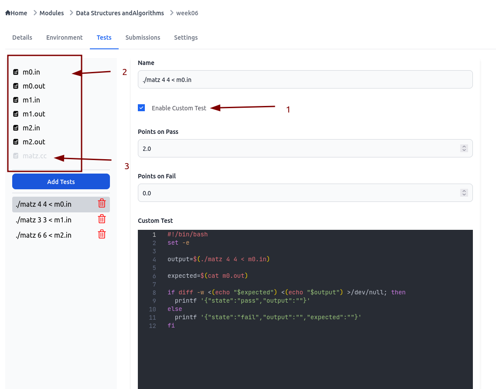
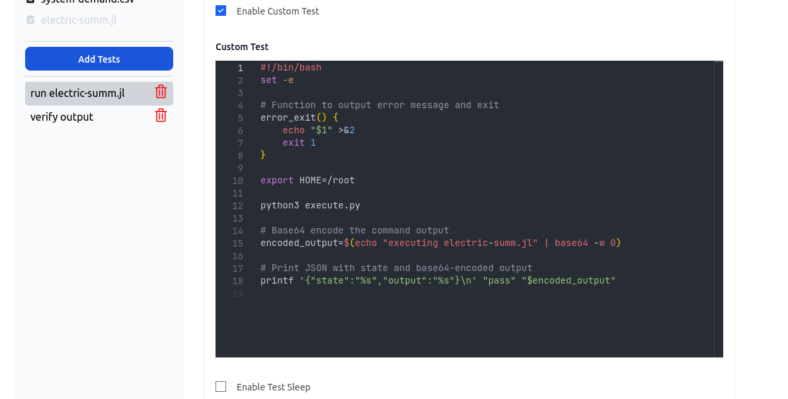
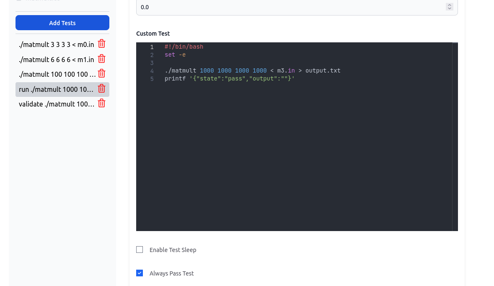

# Create Assignment


## Setup Tests

Before setting up tests, it is important to understand a few key concepts. Imagine that Handin represents your local environment, and you want to test a student's code written in C++. How would you approach this? 

The first step would be to set up a C++ compiler and compile the code. After compilation, you would obtain a binary file that can be executed, for example, `./matmult`. If this binary requires input files, you need to ensure those files are available, ideally in the current directory for simplicity. 

The binary might produce output either by printing to stdout or saving it somewhere in the filesystem. To verify this output against the expected result, you would save the expected output in a file, again for simplicity, in the same directory. Then, you could write a bash script to compare the binary's output with the expected output file. The script would return either "pass" or "fail" based on the comparison.

If this concept is clear, we can now explore how this maps to Handin.


## Environment

### Language

This section sets up the required compiler for your chosen programming language. In the backend, this is implemented using a Docker image. For most assignments, I prefer using Python because it includes a C++ compiler, provides a more versatile shell, and allows the flexibility to write Python scripts instead of shell scripts for testing purposes.

### Run Script

Remember the steps we discussed for testing a student's code in a local environment? After setting up a compiler, the next step is to compile the student's code. This section is where the compilation happens. 

Additionally, this section can be used to install extra packages if needed. However, it is generally not recommended to install packages here. A better approach would be to create a new Docker image with the required packages pre-installed and use that Docker image in the language dropdown.

### Test Resource Files

This section is where you provide the input files and the expected output files required for testing. These files are analogous to the ones you would keep in your current directory when testing locally. They serve as the resources needed to validate the student's code against the expected results.

### Solution Files

This section is optional, but it is highly recommended to upload a solution file, which contains your version of the correct solution code. This helps in verifying the tests before publishing the assignment to students. Students will not have access to this file, as it will never be included in their submission environment.

## Settings

Before adding tests, it is important to understand how the settings work. This section allows you to enable or disable specific features in the test environment. Configuring these settings properly ensures that the tests behave as expected and align with the requirements of your assignment.

### Cutoff Date

Assignment has a due date but we can also set cutoff date with some penalty which is optional. After the cutoff date, the assignment will no longer be submittable. When cutoff date is enabled, you will see penalty input field.

### Penalty per day

This field specifies the percentage of marks to be deducted from the total achieved marks for each day past the due date until the cutoff date.

### Max Attempts

This field defines the maximum number of submission attempts allowed for a student. Once the limit is reached, further submissions will be restricted.

### Total Marks

This field specifies the total marks for the assignment. Keep in mind that when setting up tests, the total marks allocated across all tests cannot exceed this value. If they do, you will get validation errors.

### Show Test Output to Students

Enabling this option will display the test output to students. However, this feature may not work as expected in certain cases. For example, if the output is a large text file (e.g., 15 MB), it could cause the browser to crash. This feature requires further improvements to handle such scenarios effectively.

### CPU & Memory

If the assignment requires additional resources, you can configure them here. For memory, you can increase it in increments of 256 MB. For example, if you need more than 256 MB, you can set it to 512 MB by adding another 256 MB increment.


## Tests

This section is where the student's binary is executed, and its output is compared against the expected output saved in the "Test Resource Files" section. Before writing the test, ensure that the "Custom Test" option is enabled. This provides the flexibility to write a bash script for testing, allowing you to define custom logic for validating the student's submission.



1. **Enable Custom Test**: Enabling this option will display a "Custom Test" input field where you can write your bash script.
2. **Uploaded Files**: The files you uploaded in the "Test Resource Files" and "Solution Files" sections will be visible here.
3. **Solution File**: This file is lighter than other files because it is to tell you that it is a solution file and any references of this file will fail when students submit their assignments.

### Name

Each test should have a descriptive and meaningful name instead of generic names like "Test 1." A clear name helps in identifying the purpose of the test and makes it easier to manage multiple tests.

### Always Pass Test

Handin makes an HTTP request to the server to execute the code and waits for a response. If the response is not received within a minute, the connection is terminated, causing the test to fail. To prevent this, you can mark the test to always pass. However, you should write an additional test to verify the output of the test to ensure correctness.

### Enable Test Sleep

In some cases, you may need to delay the execution of a test to ensure that the previous test has completed. For example, running a Julia script for a machine learning assignment might take a significant amount of time to finish. If the next test starts immediately after the first test passes, it may fail because the previous test's output is not yet ready. 

To avoid this, you can configure the second test to wait for a specified amount of time before running. This ensures that the test has sufficient time to complete successfully.

### Custom Test

This section is where you write your bash script for testing. If you prefer not to write a bash script, you can call scripts written in other programming languages. 

The only requirement is that Handin expects your script to return a JSON object in the following format:

For a passing test:
```bash
printf '{"state":"pass","output":""}'
```

For a failing test:
```bash
printf '{"state":"fail","output":"","expected":""}'
```

Below are examples of how this can be implemented:

  
